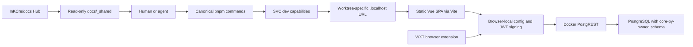

# Target Engineering Contract

## Canonical Commands

Except for the frozen install already proved in Phase 0, this list describes the target command surface; commands are not available until their implementation slice records them as complete.

Phase 2 now delivers `doctor`, `format`, `lint`, stable and shadow type checks, workspace/package
contract validation, `build`, and `check`. Unit/E2E participation and `ci` remain owned by Phases 4
and 5; the current `check` command does not claim placeholder test coverage.

- `pnpm install --frozen-lockfile` - the supported dependency bootstrap.
- `pnpm run doctor` - read-only diagnosis of versions, registry access, generated WXT state, Docker, SVC, and capability health; never prints credentials. The `run` keyword avoids pnpm's unrelated built-in `doctor`.
- `pnpm dev` - ensures the default local profile and reports stable named URLs.
- `pnpm check` - currently runs non-mutating format, lint, stable type-check, package-contract, and Phase 2 build checks; Phase 4 adds non-placeholder unit tests to this same required gate.
- `pnpm test:e2e` - deterministic web and browser-extension E2E against a seeded non-production stack.
- `pnpm build` - all static web, Module Federation, core library, and required browser-extension outputs; Phase 4 adds the Firefox artifact to the required gate.
- `pnpm ci` - the exact clean-environment contract used by GitHub Actions.

Each command:

- has stable exit behavior;
- lists participating packages;
- fails when a required package script is absent;
- does not mutate source;
- does not depend on prior generated state;
- keeps reset and cleanup behind explicit commands.

## Reproducible Toolchain

- Commit one current pnpm lockfile and stop ignoring it.
- Pin the Node/pnpm contract once at the root and synchronize contributor docs.
- Keep Oxfmt and Oxlint configuration at the root.
- Review the formatter migration as a dedicated mechanical diff before removing Prettier/Biome formatting.
- Review the lint baseline before removing ESLint/Biome linting.
- Keep a named, temporary exception only when an exact unsupported rule is proven.
- Make TS7 shadow output visible but unable to fail required CI.
- Do not add Turborepo, Nx, or another task graph without measured scheduling/cache pressure.

## Package Boundaries

- Every workspace package implements the required script vocabulary or a machine-checked exemption.
- `@inkcre/core` becomes a coherent ESM library:
  - tsdown build;
  - declarations and declaration maps;
  - valid package exports;
  - no fictional CJS entry;
  - one documented source-versus-dist development contract.
- Vite builds the Vue SPA and Module Federation remotes.
- WXT builds Chrome and Firefox extension artifacts.
- Build output, tests, and package exports form one contract; no README may claim automation that does not exist.

## Local Runtime Topology

- `web` is a worktree-scoped SVC executable capability behind Portless.
- Its health surface proves the resolved worktree instance without requiring an application Worker.
- `webext` is worktree-scoped and uses a collision-free browser profile/debug endpoint.
- `postgres` and `postgrest` are repository-scoped capabilities with pinned images and readiness probes.
- PostgREST bootstrap includes authoritative migrations, roles, deterministic test data, and explicit reset.
- Vite binds to loopback behind Portless by default; LAN access is a separate explicit profile.
- No local command can silently connect to production.

## Client Configuration Contract

- The web app's runtime authority is browser-local config.
- Public build defaults may include non-sensitive service origins, never the JWT credential.
- The JWT secret is a user-authored credential for a user-selected InKCre/PostgREST environment.
- The application validates config before use and reports its active provenance.
- A preview origin has independent browser storage; importing config is an explicit user action.
- Config export excludes the credential by default or marks the artifact as sensitive with deliberate confirmation.
- Webext storage semantics mirror the same model without pretending the currently stale adapter path works.

## Agent-Friendly Collaboration

- Root instructions point to executable commands and canonical knowledge owners.
- `pnpm run doctor` and SVC JSON output let an agent distinguish missing setup, unhealthy services, and code failures.
- Readiness probes replace sleeps and port guessing.
- Worktree identity prevents one agent from taking over another agent's server or browser profile.
- Test failure artifacts are bounded, named, and secret-safe.
- Ordinary search excludes tasks, dependencies, output, caches, and generated state.

## SVC and Knowledge Ownership

- Client-web adopts official SVC `10.0.1` with project schema v2.
- `svc.local.json` remains ignored and contains only machine-local dev overrides.
- `InKCre/docs` owns product what/why and admitted cross-unit Product TDD.
- Client-web owns enforceable source/config/test truth, admitted Unit TDD, Deployment, local instructions, and task state.
- Completed packets follow the root retention rule and are deleted without archival or deletion-time promotion review.
- Hub edits, Hub publication, shared-reference bumps, and Spoke implementation remain separate changes.
