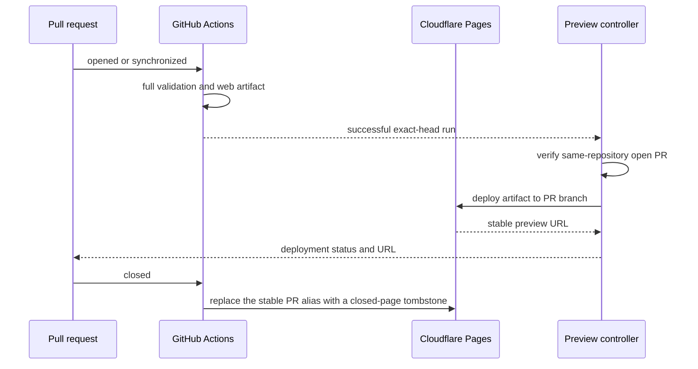

# Testing and Delivery

## Test Pyramid

- Unit:
  - Vitest for core logic and Vue behavior.
  - WXT Vitest integration for extension transforms and browser APIs.
- Contract:
  - required workspace scripts;
  - `@inkcre/core` exports and declarations;
  - environment-neutral browser artifacts, including source maps;
  - client-config provenance and persistence;
  - Module Federation remote manifests;
  - SVC adoption and shared-doc freshness.
- E2E:
  - Playwright web project against the Portless URL;
  - Playwright Chromium persistent context loading `.output/chrome-mv3`;
  - one integrated web-extension/PostgREST flow;
  - Firefox build and manifest smoke until a reliable Firefox extension driver is deliberately chosen.

E2E setup writes a test-only browser-local config for an isolated Docker stack. No JWT credential is embedded in the Pages artifact or repository.

The artifact contract rejects environment-specific service origins, client identities, loopback
service defaults, and hidden network fallbacks in both web and extension outputs. Documentation and
help links may remain only when they are not runtime configuration or bootstrap fallbacks.

Failures retain traces, screenshots, browser logs, and service logs with credentials redacted. Tests own deterministic seed/reset and cannot address production origins.

## Merge Admission

- `Workspace contract` restores the raw schema carried by the selected core release, regenerates
  the working-tree types with pinned Supabase CLI, and lets TypeScript plus consumer tests decide
  compatibility. The checked generated snapshot supports local development; byte-for-byte drift is
  not itself a merge failure.
- `client-web E2E` starts the selected immutable core service against fresh pgvector PostgreSQL,
  restores the same schema artifact, runs core-owned initialization, and exercises PostgREST
  read/write/deny behavior through the browser.
- `Dependency review` and `client-webext E2E` own dependency delta and browser-extension evidence.
- Pull-request runs provide early feedback. A GitHub merge-group run repeats all four checks against
  current client `main` and the then-current core `stable` digest. The run fails if `stable` moves
  before completion.
- Core and client branches may be developed concurrently, but core must merge and deliver first.
  There is no core-PR image selector, downstream rerun credential, or handwritten schema
  compatibility classifier.

## Pull-Request Preview

- `Client checks` owns candidate validation. It runs the full workspace, dependency, peer-database,
  and browser-extension contracts for pull requests targeting `main`.
- A successful same-repository pull-request run uploads `client-web-dist` as short-lived evidence.
  Fork pull requests can validate but do not receive a Cloudflare preview.
- `Pages preview` is a separate trusted controller. It accepts only the exact head of an open
  same-repository pull request targeting `main`, downloads that checked artifact without rebuilding
  it, and deploys the deterministic branch `preview/client-web/pr-N`.
- The stable branch alias is smoke-tested and reported back to the pull request as a GitHub
  deployment. Preview delivery is not a required merge check and has no production authority.

- Preview identity is keyed by repository and PR number.
- Repeated synchronize events update the same logical preview.
- Fork PRs run build/check without Cloudflare credentials or preview delivery.
- Closing a same-repository PR replaces its stable alias with a noindex closed-page tombstone;
  historical immutable Pages deployments remain Cloudflare delivery history.
- Deployed smoke verifies asset loading, SPA deep links, and absence of the removed `/api/config` dependency.
- Full data E2E remains local/CI Docker by default because human preview configuration is browser-local and origin-specific.

## Production

- Protected `main` is the only production authority after cutover. Pull-request artifacts are never
  promoted to production.
- Every `main` push starts a focused release run from that exact source SHA. The secret-free build
  job performs a frozen install, builds only `@inkcre/client-web`, verifies the static and
  environment-neutral artifact contract, and uploads `client-web-dist`.
- The production job downloads that artifact from the same workflow run without rebuilding it,
  proves that `main` still points to the selected SHA, deploys the fixed Pages branch `main`, and
  smoke-tests both the exact Pages deployment and `https://app.inkcre.dev`.
- Release evidence records source SHA, workflow run, artifact digest, Pages deployment ID, and URL.
  Independent pull-request and release builds are not expected to be byte-identical.
- The normal rollback is a revert pull request followed by a new protected-main release. Database
  state is outside a static-client release.

## Browser Extension Artifacts

- Every PR builds Chrome and Firefox outputs.
- Chromium E2E loads the exact built output later retained as the CI artifact.
- Extension store publication is not implied by web production CD; it requires a separate version/tag/review contract.
