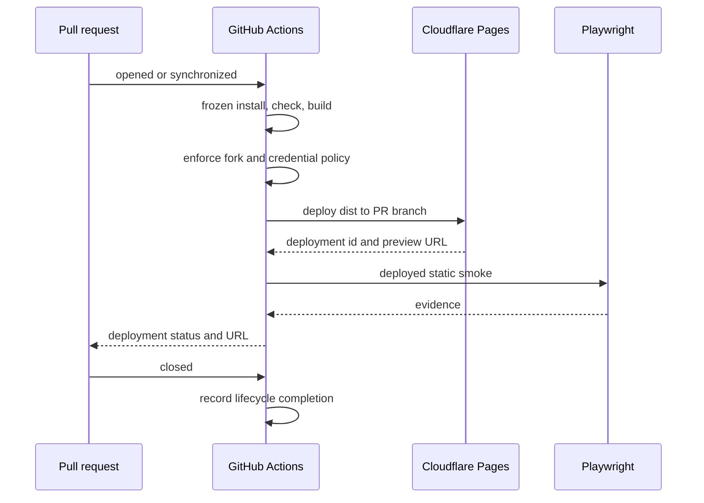

# Testing and Delivery

## Test Pyramid

- Unit:
  - Vitest for core logic and Vue behavior.
  - WXT Vitest integration for extension transforms and browser APIs.
- Contract:
  - required workspace scripts;
  - `@inkcre/core` exports and declarations;
  - public environment allowlist;
  - client-config provenance and persistence;
  - Module Federation remote manifests;
  - SVC adoption and shared-doc freshness.
- E2E:
  - Playwright web project against the Portless URL;
  - Playwright Chromium persistent context loading `.output/chrome-mv3`;
  - one integrated web-extension/PostgREST flow;
  - Firefox build and manifest smoke until a reliable Firefox extension driver is deliberately chosen.

E2E setup writes a test-only browser-local config for an isolated Docker stack. No JWT credential is embedded in the Pages artifact or repository.

Failures retain traces, screenshots, browser logs, and service logs with credentials redacted. Tests own deterministic seed/reset and cannot address production origins.

## Pull-Request Preview

Recommended authority split:

- GitHub Actions owns install, verification, policy, concurrency, and deployment evidence.
- Cloudflare Pages owns static hosting and deployments.
- Wrangler Pages direct upload runs only after required checks.

- Preview identity is keyed by repository and PR number.
- Repeated synchronize events update the same logical preview.
- Fork PRs run build/check without Cloudflare credentials unless explicitly approved through a protected path.
- Deployed smoke verifies asset loading, SPA deep links, and absence of the removed `/api/config` dependency.
- Full data E2E remains local/CI Docker by default because human preview configuration is browser-local and origin-specific.

## Production

- `main` is the only production policy branch after cutover.
- Required checks and a protected GitHub production environment gate Pages deployment.
- CI deploys the exact `dist` artifact produced by the accepted commit and records commit, artifact digest, Pages deployment ID, and URL.
- Production smoke checks the custom domain, static assets, history fallback, and config UI without injecting a credential.
- Rollback selects a previous verified Pages deployment; database state is outside a static-client release.

## Browser Extension Artifacts

- Every PR builds Chrome and Firefox outputs.
- Chromium E2E loads the exact built output later retained as the CI artifact.
- Extension store publication is not implied by web production CD; it requires a separate version/tag/review contract.
